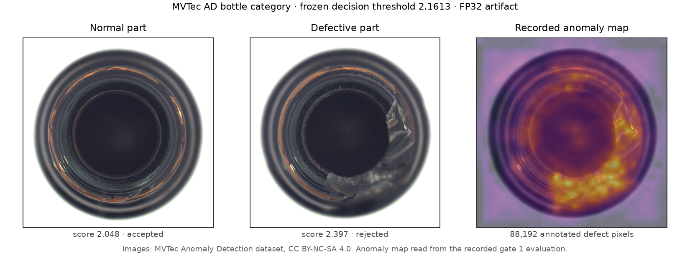
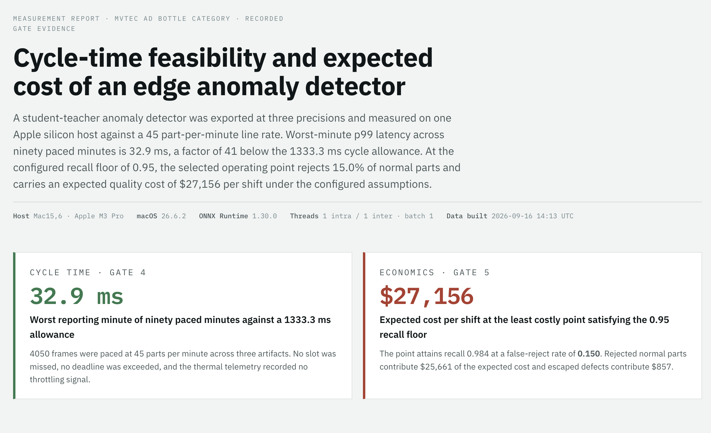
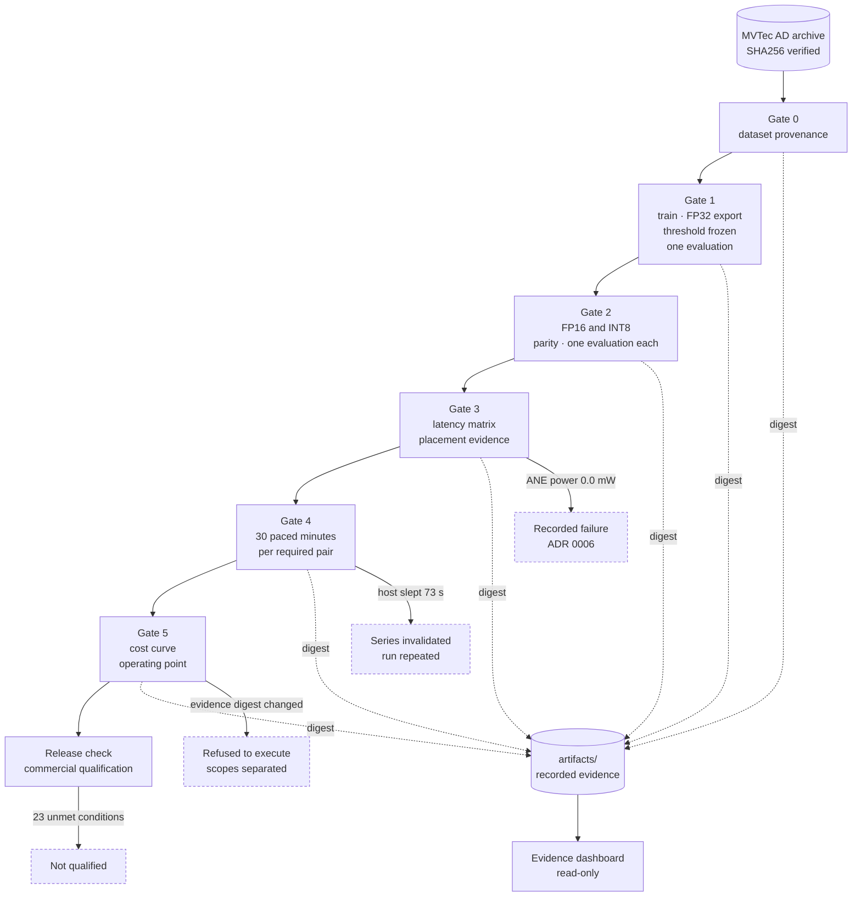
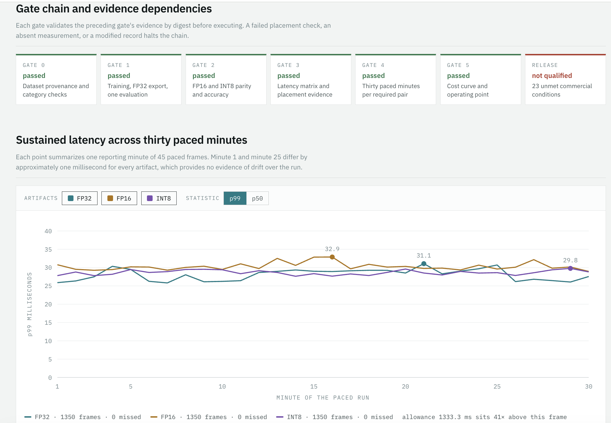
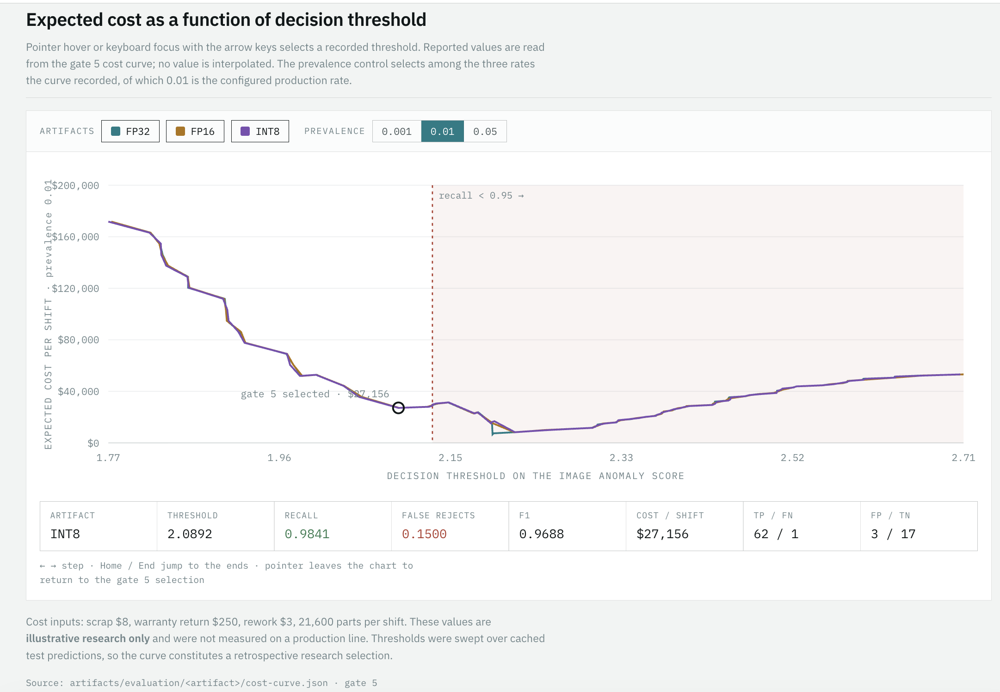
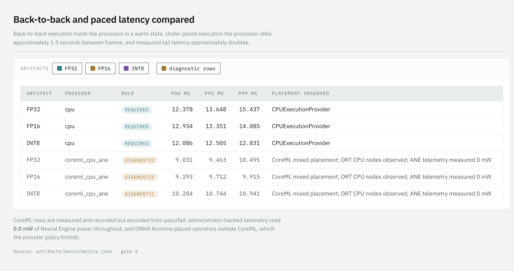
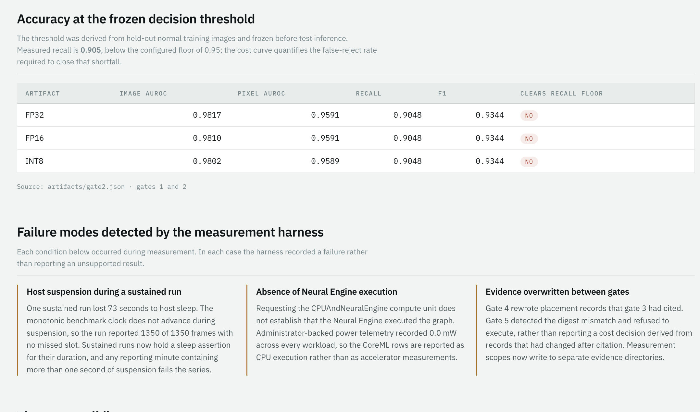

# cycletime-inspect

**A measurement pipeline that establishes whether an edge anomaly detector is fast enough, accurate enough, and economical enough for a production line, and that records a failure in place of any number it cannot support.**

An industrial camera photographs each bottle leaving a filling line and must return an accept or reject decision before the next part arrives, one every 1.33 seconds. This repository trains a student-teacher anomaly detector for that task, exports it at three numeric precisions, and measures it under six acceptance gates on one Apple silicon host. The gates establish that inference is not the constraint: worst-minute p99 latency across ninety paced minutes is 32.9 ms, a factor of 41 below the cycle allowance. They also establish that the detector is not economical: at the configured recall floor of 0.95, the selected operating point rejects 15.0% of normal parts and carries an expected quality cost of $27,156 per shift under the configured assumptions. The accuracy of the detector, not its speed, is the limiting factor.



The detector scores each part and compares that score with a threshold frozen before any test image was seen. Above, a normal part scores 2.048 and is accepted; a bottle with a broken rim scores 2.397 and is rejected; the third panel shows the anomaly map recorded during the gate 1 evaluation. Images are from the MVTec Anomaly Detection dataset under CC BY-NC-SA 4.0, and `scripts/build_sample_figure.py` regenerates the figure from local data ([ADR 0009](docs/decisions/0009-detection-example-figure.md)).



---

## Results

| Question | Finding | Evidence |
|---|---|---|
| Does inference meet the 45 part-per-minute cycle? | Yes. Worst reporting minute 29.8–32.9 ms against a 1333.3 ms allowance | [docs/sustained.md](docs/sustained.md) |
| Does it hold under sustained load? | Yes. 1350 of 1350 frames per artifact, no missed slot, no deadline exceeded, no throttling signal | [docs/sustained.md](docs/sustained.md) |
| Is detection accurate enough? | Image AUROC 0.982, pixel AUROC 0.959. Recall 0.905 at the frozen threshold, below the 0.95 floor | [docs/gate1.md](docs/gate1.md) |
| Is deployment economical? | No. Satisfying the recall floor requires a 0.150 false-reject rate, costing $27,156 per shift | [docs/scorecard.md](docs/scorecard.md) |
| Did the Neural Engine execute the model? | No. Administrator-backed telemetry recorded 0.0 mW of ANE power across every CoreML workload | [ADR 0006](docs/decisions/0006-coreml-without-ane-requirement.md) |
| Is the system commercially qualified? | No. The release check refuses with 23 unmet conditions | `make release-check` |

### Cost as a function of the recall constraint

Expected cost is computed as `N·[π·FNR·Cw + (1−π)·FPR·Cs + π·TPR·Cr]` over cached test predictions, with prevalence taken from configuration rather than from the test split's defect ratio.

| Decision rule | Artifact | Threshold | Recall | False rejects | Cost per shift |
|---|---|---:|---:|---:|---:|
| Least cost satisfying recall and latency | INT8 on CPU | 2.089220 | 0.984 | 0.150 | **$27,156** |
| Maximum F1, identical assumptions | FP32 (comparison only) | 2.089352 | 0.984 | 0.150 | $27,156 |
| Frozen validation threshold | INT8 on CPU | 2.161340 | 0.905 | 0.100 | $22,836 |
| Least cost overall, floor not satisfied | INT8 on CPU | 2.217 | 0.857 | 0.000 | $8,270 |

Rejected normal parts account for $25,661 of the selected point's expected cost and escaped defects for $857, a ratio of approximately 30 to 1. The cost rule and the maximum-F1 rule selected equivalent points in this run, so that comparison is uninformative here. All monetary inputs are illustrative research values in [config/costs.yaml](config/costs.yaml) and were not measured on a production line.

---

## Measurement pipeline



Each gate validates the preceding gate's evidence by digest before executing. Evidence is written once and cited by hash; a record modified after citation halts the chain. The four dashed outcomes are real events from this project's measurement sessions, described below.

**Protocol.** Microbenchmarks discard exactly 20 warmup iterations and retain 500 timed batch-one completions, timing preprocessing, synchronous inference, and postprocessing on decoded images. Sustained runs pace one frame per 1.333 s against absolute monotonic deadlines for 30 minutes per pair, recording each minute's p99 and sample count, every missed slot, and thermal telemetry sampled once per second in a separate process. Each exported artifact receives exactly one full test-set evaluation, reserved in a locked ledger before inference.

---

## Failure modes detected by the harness

Three conditions arose during measurement that would have produced confident but unsupported numbers in a conventional benchmark.

**Host suspension.** One sustained run lost 73 seconds to macOS sleep. The monotonic benchmark clock does not advance during suspension, so the run reported 1350 of 1350 frames with no missed slot. Sustained runs now hold a sleep assertion, and any reporting minute containing more than one second of suspension fails the series.

**Absent accelerator execution.** Requesting the `CPUAndNeuralEngine` compute unit does not establish that the Neural Engine executed the graph. The CoreML provider in ONNX Runtime 1.30 rejects `HardSwish`, partitioning each MobileNet into approximately 18 segments; a single-partition export still executed FP32 on the CPU, and FP16 on the accelerator violated the anomaly-map parity tolerance. Power telemetry recorded 0.0 mW throughout. The result is recorded as a failure rather than relabelled as accelerator timing.

**Evidence overwritten between gates.** Gate 4 rewrote placement records that Gate 3 had cited. Gate 5 detected the digest mismatch and refused to execute. Measurement scopes now write to separate evidence directories.

---

## Evidence dashboard

`make dashboard` extracts recorded evidence into a data file and serves a read-only review surface on the local host. The dashboard renders values copied from gate records; it recomputes no quantile and interpolates no curve, and its scope is bounded by [ADR 0008](docs/decisions/0008-evidence-dashboard.md).



Each point summarizes one reporting minute of 45 paced frames. Minute 1 and minute 25 differ by approximately one millisecond for every artifact, which provides no evidence of drift over the run.



The threshold inspector reports recall, false-reject rate, F1, expected cost, and the underlying confusion counts at any recorded threshold, selected by pointer or by arrow key. The shaded region marks thresholds that fail the recall floor. The prevalence control switches among the three rates the curve recorded.



CoreML rows are measured and recorded but excluded from pass and fail decisions, because ONNX Runtime placed operators outside CoreML and telemetry recorded no accelerator activity ([ADR 0007](docs/decisions/0007-coreml-diagnostic-provider.md)).



---

## Engineering scope

| Component | Implementation |
|---|---|
| Model and export | MobileNetV3 student-teacher detector, canonical FP32 export, mixed FP16/FP32 and INT8/FP32 conversion with parity verification |
| Measurement | Microbenchmark and paced sustained harness, provider placement capture, administrator-backed power telemetry, host-suspension detection |
| Decision | Expected-cost curve over cached predictions, constrained operating-point selection with deterministic tie-breaking, maximum-F1 comparator |
| Agent | Bounded plan-act-observe loop over five allowlisted tools with per-tool schemas, tenant scoping, budgets, checkpoints, and an append-only audit trail |
| LLM | Transport requiring configured pricing and credentials, retrieval restricted to approved hash-verified documents, claim grounding that binds every stated number to an evidence field |
| Production | Signed release verification, offline station runtime that faults rather than accepting, externally authorized rollback, telemetry with retention and tenant controls |

68 tests pass; contract tests fail rather than skip when a behavior is unproven. Sixteen contracts in [AGENTS.md](AGENTS.md) are enforced in code, including the requirements that latency originate in a measured run, that each artifact receive exactly one evaluation, that provider availability never substitute for placement evidence, and that no gate pass by skipping an unsupported configuration.

---

## Reproducing the measurements

```bash
make lock && make install     # uv, Python 3.12, lock generated on the target platform
make fetch                    # verified download against the approved SHA256
make gate0 && make gate1      # dataset checks, training, canonical export, sole FP32 evaluation
make gate2                    # FP16 and INT8 exports with parity and one evaluation each
make gate3                    # latency matrix (approximately 1 minute)
make gate4                    # 30 paced minutes per required pair (approximately 90 minutes)
make gate5                    # cost curve, operating point, scorecard, figures
make gates                    # the full sequence
make dashboard                # build the evidence data file and serve the dashboard locally
make release-check            # enumerate unmet commercial conditions
make test && make lint        # 68 tests, ruff
```

`make capture-ane` records administrator-backed powermetrics traces and prompts for a password in an interactive terminal. `make agent-plan` drafts an experiment plan; `make agent-run` executes only a plan an operator has authorized.

---

## Threats to validity

- **Dataset licence.** MVTec AD is distributed under CC BY-NC-SA 4.0 and prohibits commercial use. Deployment requires customer-owned data, retraining, and independent validation.
- **Retrospective threshold.** The selected operating point was swept over 242 cached test thresholds and constitutes a research selection, not a validated operating threshold. A release requires separate labeled validation data and untouched customer test data.
- **Illustrative economics.** Prevalence, scrap, warranty, and rework values are configured assumptions rather than measurements from a production line.
- **Symmetric release signing.** The implemented HMAC-SHA256 scheme demonstrates tamper detection but is not a production trust model; asymmetric signing is required before deployment.
- **Single category and host.** All measurements cover the `bottle` category on one Apple M3 Pro workstation without enclosure or ambient control.
- **Model-only timing.** Camera acquisition, transport, and actuation remain unmeasured, so only research cycle feasibility is claimed.

---

## Repository map

| Path | Contents |
|---|---|
| [cycletime/](cycletime/) | dataset I/O, model, export, benchmark, cost, reporting, agent, LLM, production |
| [config/](config/) | dataset, model, export, bench, costs, agent, and production configuration; every threshold and monetary value resides here |
| [docs/](docs/) | gate reports, latency and sustained tables, scorecard, runbook, screenshots, and nine decision records |
| [dashboard/](dashboard/) | read-only evidence dashboard and its generated data file |
| [artifacts/](artifacts/) | recorded evidence: hashes, raw samples, placement traces, figures (git-ignored) |
| [tests/](tests/) | 68 tests across unit, parity, bench, and hardware contract suites |

The repository distributes no dataset archive, no bulk dataset images, and no trained weights; the single detection example figure carries its dataset attribution and licence notice. Design rationale is recorded in [docs/decisions/](docs/decisions/), and the remaining work for a commercial deployment is enumerated in [docs/production.md](docs/production.md).
