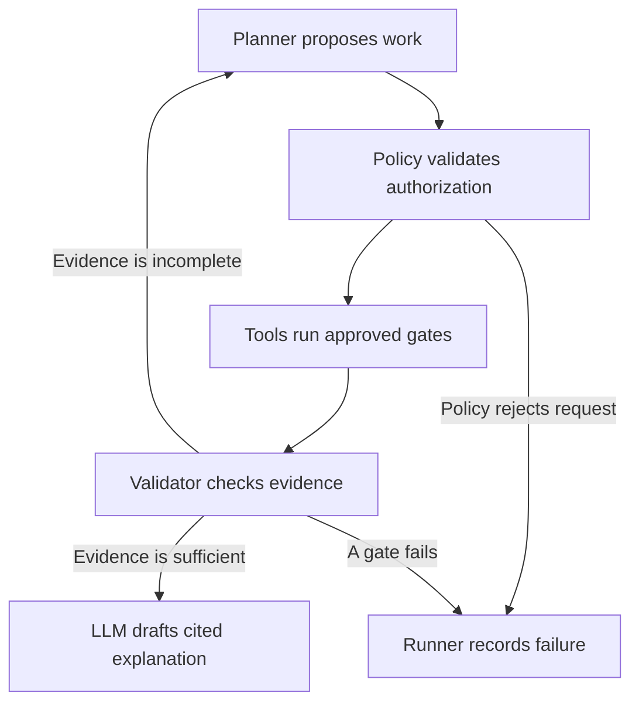

# ADR 0002 places the LLM beside the measurement pipeline.

The product integrates an LLM into experiment planning and evidence interpretation.
The anomaly model continues to produce every per-image score locally.
The LLM never receives a place in the timed inference graph.

The planner reads the artifact inventory and identifies missing measurements.
The planner may propose a supported export/provider experiment and estimate its scheduling duration from the required protocol.
The planner must not estimate the experiment's inference latency.
The tool runner executes only the authorized plan through typed local functions.
The evidence validator checks hashes, schemas, citations, and acceptance criteria.
The LLM writes an explanation from the verified result after measurement completes.

The workflow follows a bounded state transition.

The implementation uses one orchestrator with distinct roles and deterministic tools.
The project does not need multiple concurrent LLM agents to demonstrate agentic behavior.
The workflow becomes agentic when it chooses an allowed next action from observed evidence, executes that action, and checks its result.
Checkpoints and idempotency keys make that behavior inspectable after interruption.

A useful request asks which measured configuration satisfies the line budget and why the cost-selected threshold differs from the maximum-F1 threshold.
The deterministic cost module answers the numerical question.
The LLM explains the answer and cites the scorecard fields that support it.
A procedure lookup can connect a measured symptom with a customer's approved troubleshooting document.
The LLM must label a suggested cause as a hypothesis until inspection evidence establishes it.

The adapter uses HTTP only after the operator configures a provider, model, credentials, schema mapping, and token prices.
The scaffold does not assume that every provider accepts the same wire format.
The LLM integration remains a typed stub until that adapter and its tests exist.
A local provider may satisfy the same interface when the customer requires local processing.

The runner suspends LLM work during benchmarks to avoid interference with CPU load and thermal state.
The runner applies separate limits to conversational work and explicitly authorized long measurements.
The runner must audit tool arguments, outputs, model versions, token usage, and termination reasons.
An LLM outage must leave ordinary inspection operational.
